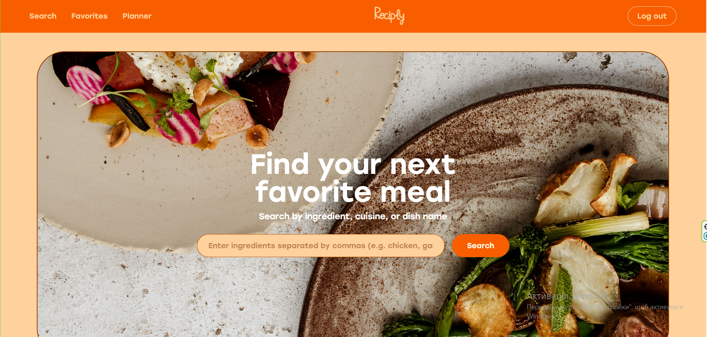
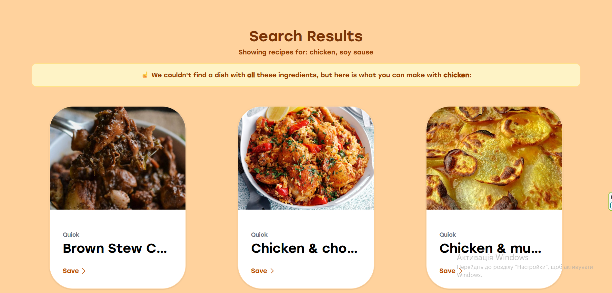
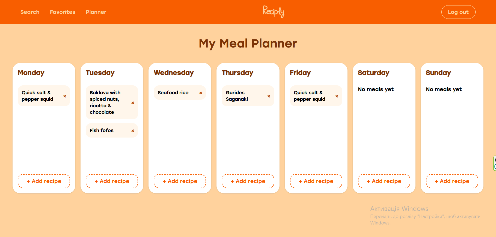

# 🍳 Reciply

A recipe finder and meal planner web app built with React. Search for recipes by ingredient or dish name, save your favorites, and plan your meals for the week.

**[Live Demo](https://reciply-xi.vercel.app/)** · **[GitHub](https://github.com/apohorila/Reciply)**

---

## Screenshots





---

## Features

- 🔍 **Recipe Search** — search by dish name or ingredient, filter by cuisine
- 📖 **Recipe Detail** — full ingredients list, step-by-step instructions, source and YouTube links
- ❤️ **Favorites** — save recipes to your personal favorites, synced to your account
- 📅 **Meal Planner** — plan your meals for each day of the week
- 🔐 **Authentication** — email/password and Google sign in via Firebase

---

## Tech Stack

| Category        | Technology               |
| --------------- | ------------------------ |
| Frontend        | React, Vite              |
| Routing         | React Router v6          |
| Styling         | Tailwind CSS             |
| Auth & Database | Firebase Auth, Firestore |
| API             | TheMealDB                |
| Deployment      | Vercel                   |

---

## React Concepts Used

- Functional components and JSX
- `useState`, `useEffect`, `useRef`, `useCallback`, `useMemo`
- `useContext` + `useReducer` for global state
- Custom hooks — `useFavorites`, `useMealPlan`
- React Router v6 — nested routes, `useParams`, `useNavigate`, `useSearchParams`
- Protected routes with `ProtectedRoute` component
- Controlled forms and inputs
- Conditional rendering and list rendering
- Component composition and reusability

---

## Getting Started

### Prerequisites

- Node.js 18+
- npm or yarn
- Firebase project with Authentication and Firestore enabled

### Installation

1. Clone the repository

```bash
git clone https://github.com/apohorila/Reciply.git
cd Reciply
```

2. Install dependencies

```bash
npm install
```

3. Create a `.env` file in the root directory

```bash
cp .env.example .env
```

4. Add your environment variables to `.env`

```
VITE_FIREBASE_API_KEY=your_value
VITE_FIREBASE_AUTH_DOMAIN=your_value
VITE_FIREBASE_PROJECT_ID=your_value
VITE_FIREBASE_STORAGE_BUCKET=your_value
VITE_FIREBASE_MESSAGING_SENDER_ID=your_value
VITE_FIREBASE_APP_ID=your_value
```

5. Start the development server

```bash
npm run dev
```

---

## Project Structure

```
src/
├── api/          # API functions (TheMealDB, Firestore)
├── components/   # Reusable UI components
├── context/      # AuthContext, MealPlanContext
├── hooks/        # Custom hooks (useFavorites, useMealPlan)
├── pages/        # Page components
└── utils/        # Helper functions
```

---

## Author

**Anna Pohorila**

- GitHub: [@apohorila](https://github.com/apohorila)
- LinkedIn: [Anna Pohorila](https://www.linkedin.com/in/anna-pohorila-45133b314/)
